# Contexto y problema

## ¿Qué hace viable un sitio?

- La transición energética exige identificar sitios óptimos para infraestructura fotovoltaica.
- La viabilidad depende de variables climáticas, topográficas y ambientales.
- Las estructuras de inclinación fija son sensibles a la geomorfometría: pendientes y orientaciones inadecuadas generan auto-sombreado.

## Componentes de un sistema fotovoltaico

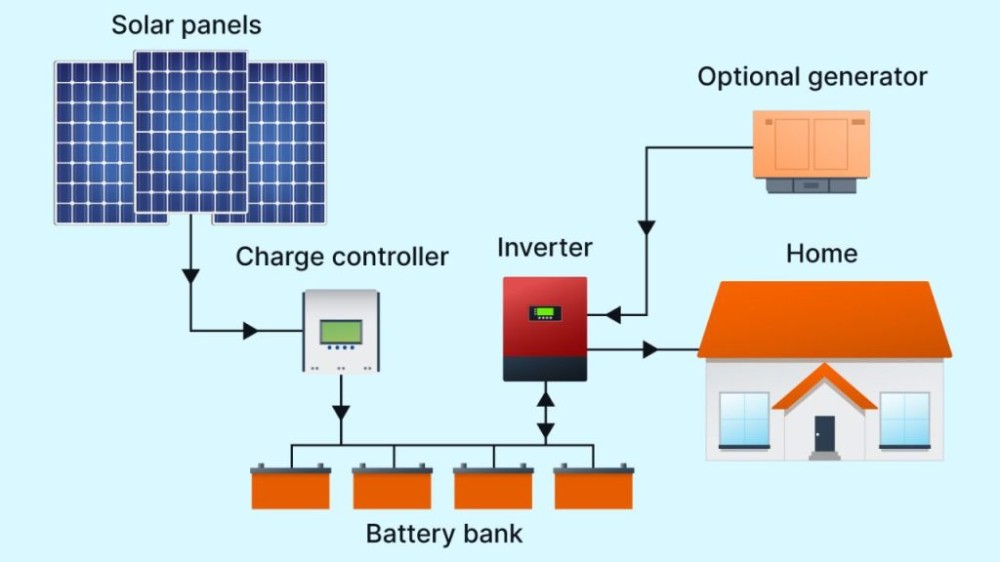{fig-align="center" width="58%"}

## El recurso solar de Colombia

:::: {.columns}
::: {.column width="48%"}
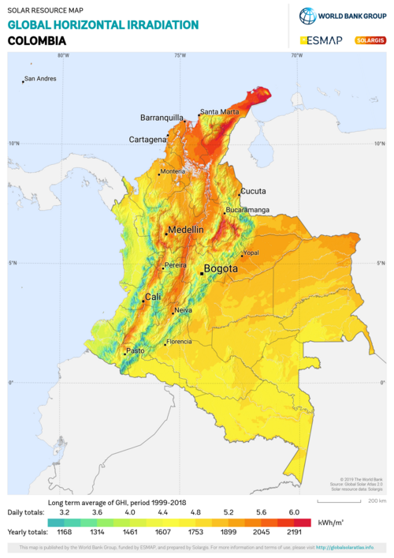{fig-align="center" width="62%"}
:::
::: {.column width="52%"}
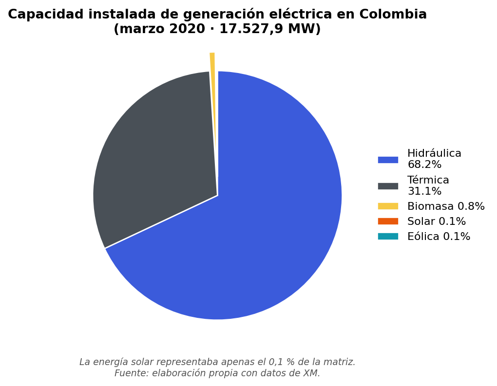{fig-align="center" width="100%"}
:::
::::

::: {style="font-size: 0.6em; color: gray;"}
Buen recurso solar (más de 5 kWh/m²/día en amplias zonas), pero la solar era apenas el 0,1 % de la matriz: hay margen para crecer.
:::

## Planificación de un parque solar

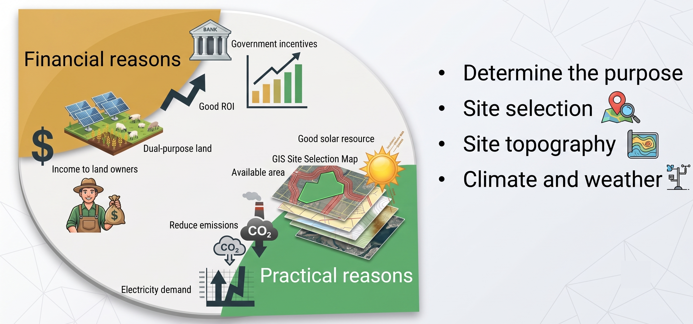{fig-align="center" width="82%"}

## Aporte del proyecto

- Integración de MCDA-AHP [@saaty1980ahp; @malczewski2006gis] para acotar la subjetividad.
- Geomorfometría desde un DEM de alta resolución para capturar la micro-topografía.
- **Entregable: el complemento PyQGIS `solar_site_suitability`**, publicado y en validación en plugins.qgis.org.
- Filosofía Open Science: formatos abiertos, código en GitHub, licencia GPL-3.0.

# Objetivos

## Objetivo general y específicos

**General:** desarrollar un modelo geomático multicriterio (AHP) y una herramienta automatizada en PyQGIS para identificar zonas de máxima idoneidad.

**Específicos**

- Armonizar GHI (raster propio o ERA5 SSRD) y variables geomorfométricas desde un DEM.
- Estructurar una matriz AHP validada con la Relación de Consistencia ($CR < 0.10$).
- Desarrollar, probar y publicar un complemento PyQGIS que extraiga polígonos viables por encima de un área mínima.
- Verificar el funcionamiento de la herramienta en un caso real.

# Área de estudio

## Una herramienta de aplicación general

- `solar_site_suitability` no incorpora ningún dataset regional fijo.
- Funciona en cualquier territorio con tres insumos: **DEM + GHI + cobertura del suelo**.
- Sirve para Colombia, Chile, España, India o cualquier sitio del mundo.
- Corrección clave para uso mundial: **selector de hemisferio** (norte favorable al sur; sur favorable al norte).

## Caso de demostración: Concordia (Antioquia)

- Municipio del suroeste antioqueño, relieve heterogéneo y casco urbano a excluir.
- Procesamiento en EPSG:9377 (MAGNA-SIRGAS / Origen Nacional), 1.0 m.
- Fuente de radiación: **ERA5 SSRD** (Copernicus), periodo agosto 2025.

## Localización del área de estudio

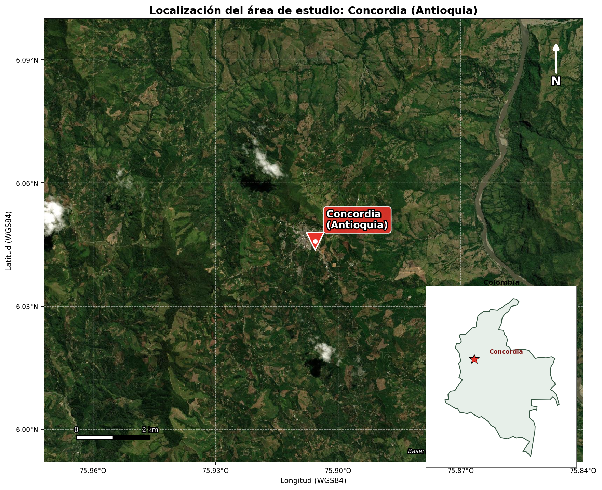{fig-align="center" width="60%"}

# Fuentes de datos

## Insumos abiertos

| Insumo | Variable | Fuente | Resolución |
|--------|----------|--------|-----------:|
| Radiación solar | GHI o ERA5 SSRD | Raster propio o ERA5 Copernicus [@munozsabater2021era5] | reanálisis / remuestreado |
| Elevación | Pendiente / Orientación | DEM de alta resolución | 12.5 m o mejor |
| Cobertura | Máscara de exclusión | Producto LULC (raster o vectorial) | variable |

- La radiación puede ser un GHI propio o descargarse de ERA5 (Copernicus) y convertirse a GHI.
- La cobertura admite raster o capa vectorial de polígonos, más exclusiones del usuario (p. ej. casco urbano).

# Metodología

## Restricciones espaciales absolutas

| Variable | Umbral (por defecto) | Justificación |
|----------|--------|---------------|
| Pendiente | $> 15^\circ$ | Auto-sombreado y ángulo de incidencia |
| Orientación | Lado polar | Baja captación de radiación directa |
| Cobertura | Clases del usuario (bosque, agua, urbano) | Conservación / conflicto de uso |
| Área | Menor al mínimo configurado | Inviabilidad de implantación operativa |

## Reclasificación y pesos AHP

| Criterio | Peso (def.) | Excelente (5) | Bueno (4) | Moderado (3) | Pobre (1–2) |
|----------|-----:|---------------|-----------|--------------|-------------|
| GHI | 0.286 | $>5.5$ | $5.0$–$5.5$ | $4.5$–$5.0$ | $<4.5$ |
| Pendiente | 0.571 | $0$–$5^\circ$ | $5$–$10^\circ$ | $10$–$15^\circ$ | $>15^\circ$ |
| Orientación | 0.143 | Ecuatorial | Intermedia | E, O | Polar |

::: {style="font-size: 0.6em; color: gray;"}
Esquema por defecto; los pesos son configurables (el caso Concordia usa ponderación equitativa).
:::

## Consistencia del modelo (AHP)

$$
S = \left( \sum_{i=1}^{n} W_i \cdot C_i \right) \times \prod_{j=1}^{m} R_j
\qquad
CR = \frac{CI}{RI}
$$

- Matriz aceptada solo si $CR < 0.10$ [@islam2024site].
- El usuario expresa las comparaciones en lenguaje verbal; el plugin construye la matriz y valida la consistencia.

## El análisis de un vistazo

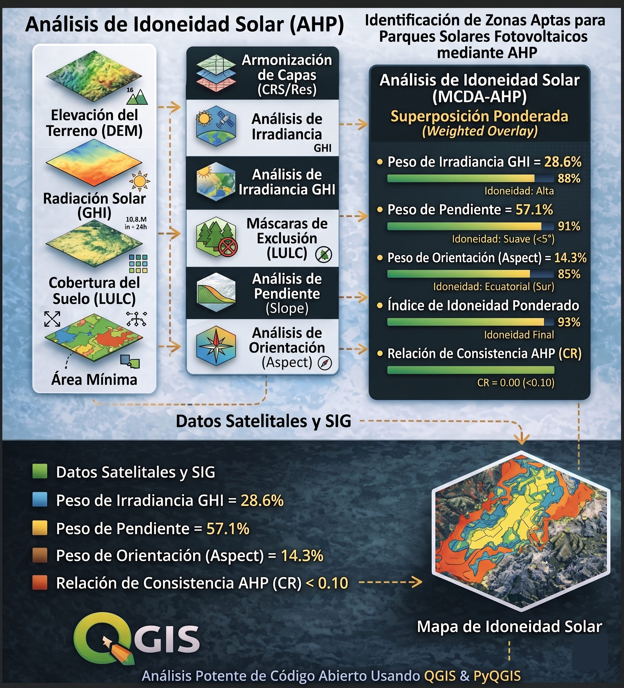{fig-align="center" width="40%"}

## Flujo de geoprocesamiento (PyQGIS)

```{mermaid}
flowchart LR
    A["Datos"] --> B["Pendiente<br/>Orientación"]
    A --> C["GHI /<br/>ERA5"]
    B --> D["Reclas.<br/>1-5"]
    C --> D
    D --> E["Overlay<br/>AHP"]
    E --> F["Máscaras"]
    F --> G["Umbral"]
    G --> H["Polígonos<br/>óptimos"]
```

## Algoritmos abiertos en PyQGIS

| Operación | Algoritmo QGIS / PyQGIS |
|-----------|--------------------------|
| Proyección/recorte | `gdal:warpreproject` |
| Pendiente / Orientación | `gdal:slope` / `gdal:aspect` |
| Modelado de idoneidad | Crop Site Suitability Analysis (ICIMOD) |
| Overlay ponderado | Álgebra con pesos AHP |
| Vectorización | `gdal:polygonize` |
| Filtro por área | `native:extractbyexpression` |

# El complemento `solar_site_suitability`

## Arquitectura modular

```{mermaid}
flowchart TD
    INIT["__init__.py"] --> MAIN["main_plugin.py"]
    MAIN --> UI["ui/main_dialog"]
    UI --> WF["core/workflow"]
    WF --> AHP["ahp"]
    WF --> RAS["raster_ops"]
    WF --> ERA["era5"]
    WF --> REP["reporting"]
```

## Interfaz: entradas y parámetros

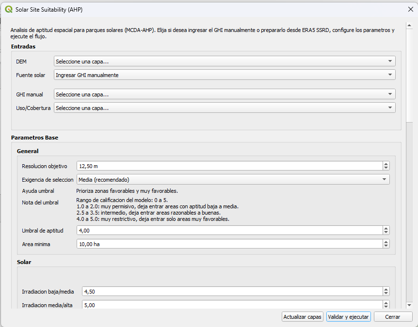{fig-align="center" width="52%"}

## Interfaz: topografía y hemisferio

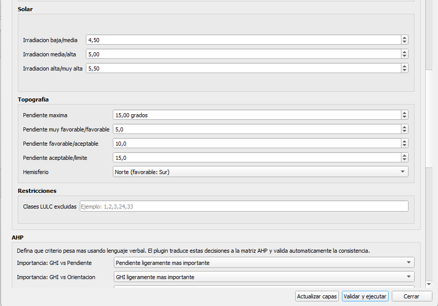{fig-align="center" width="52%"}

## Interfaz: matriz AHP y validación

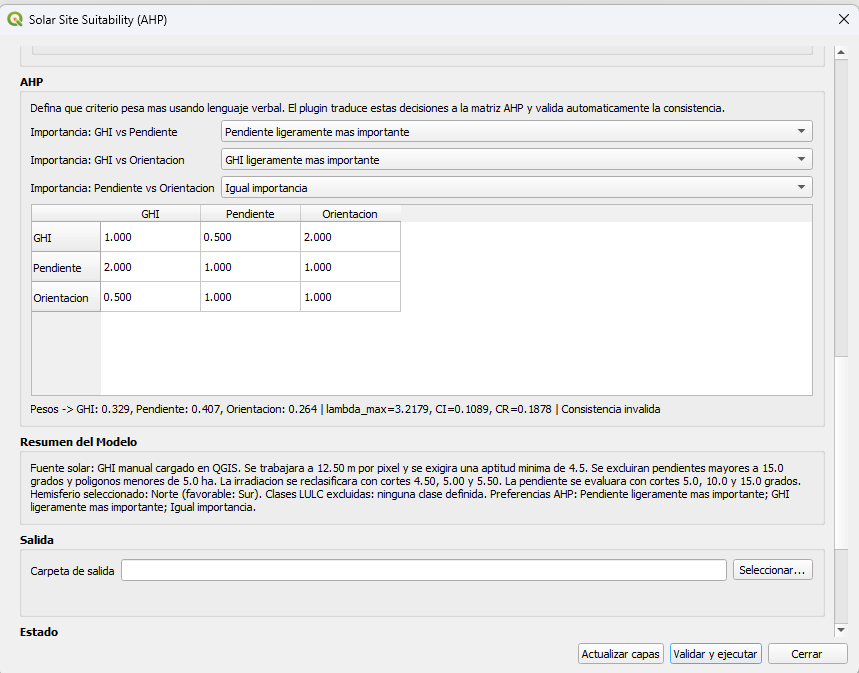{fig-align="center" width="52%"}

## ERA5 y corrección de georreferenciado

```{mermaid}
flowchart LR
    D["Extensión<br/>del DEM"] --> A["Solicitud<br/>ERA5"]
    A --> B["Descarga<br/>cdsapi"]
    B --> C["SSRD<br/>a GHI"]
    C --> E["Georref.<br/>GRIB"]
    E --> F["GHI<br/>listo"]
```

- Descarga solo el cuadro envolvente del DEM, no datos globales.
- Reconstruye el geotransform desde metadatos GRIB y corrige el desfase de medio píxel.
- `cdsapi` es **dependencia opcional**: el flujo con GHI manual no requiere librerías externas.

## Por qué un selector de hemisferio

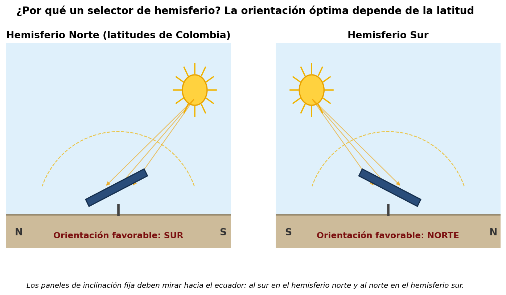{fig-align="center" width="78%"}

## Calidad, pruebas y publicación

- Pruebas unitarias puras (AHP, configuración, reportes) que corren sin QGIS.
- Licencia GPL-3.0, icono, `metadata.txt`, dataset de muestra.

::: {.callout-important}
Publicado en plugins.qgis.org: el escáner automático (Bandit, detect-secrets, flake8) se superó sin hallazgos críticos. En proceso de validación por el comité.
:::

## Evidencia: plugin en plugins.qgis.org

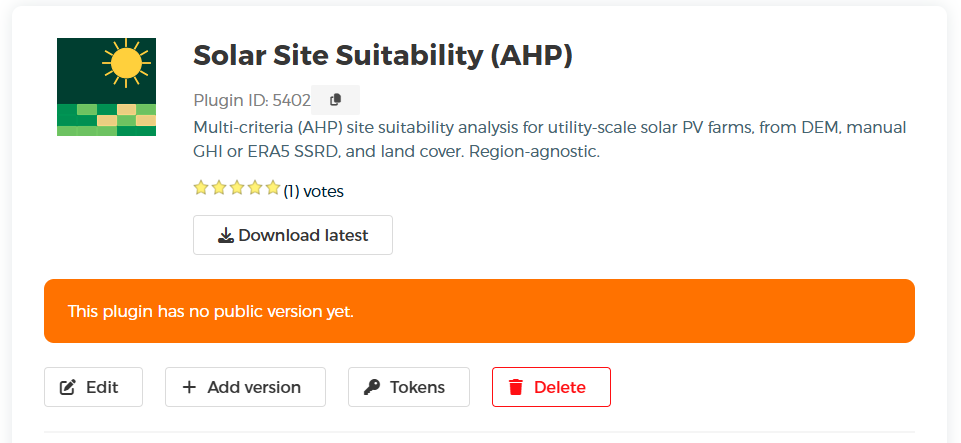{fig-align="center" width="62%"}

# Resultados

## Ejecución de demostración: Concordia

::: {style="font-size: 0.72em;"}
| Parámetro | Valor |
|-----------|-------|
| Fuente / CRS / resolución | ERA5 SSRD · EPSG:9377 · 1.0 m |
| Umbral / área mínima | 2.0 · 0.2 ha |
| Aspectos / LULC excluidos | N, NW · 1,2,3,4 |
| Exclusión vectorial | polígono `Urbano_Concordia` |
| Pesos AHP | 0.333 / 0.333 / 0.333 ($CR=0$) |
| ERA5 | 2025-08-01 a 04, 07:00–17:00 |
:::

- Resultado: **15 polígonos**, **6.776 ha** totales (máx. 0.928 ha, mín. 0.207 ha).

## Sitios viables (Concordia)

{fig-align="center" width="62%"}

## Polígonos óptimos (Concordia)

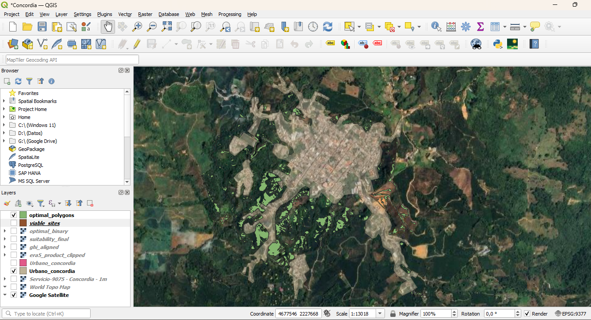{fig-align="center" width="62%"}

## Archivos generados

- La ejecución guarda **todos** los productos en la carpeta de salida indicada:
  - Solicitud y productos ERA5 (JSON, NetCDF, GeoTIFF, CSV) y raster recortado.
  - Capas intermedias: DEM armonizado, pendiente, orientación, reclasificaciones y máscaras.
  - Raster de aptitud, sitios viables y polígonos óptimos.
  - Reportes HTML y CSV con el resumen del modelo.

# Conclusiones

## Aportes principales

- **Avance metodológico:** del booleano al AHP validado por $CR$.
- **Herramienta publicada:** complemento modular, probado y en validación en plugins.qgis.org.
- **Software libre