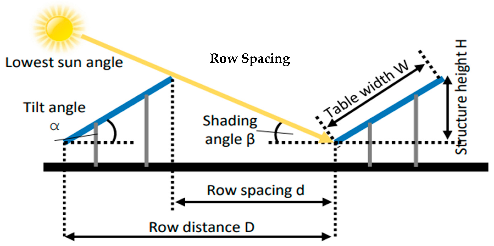
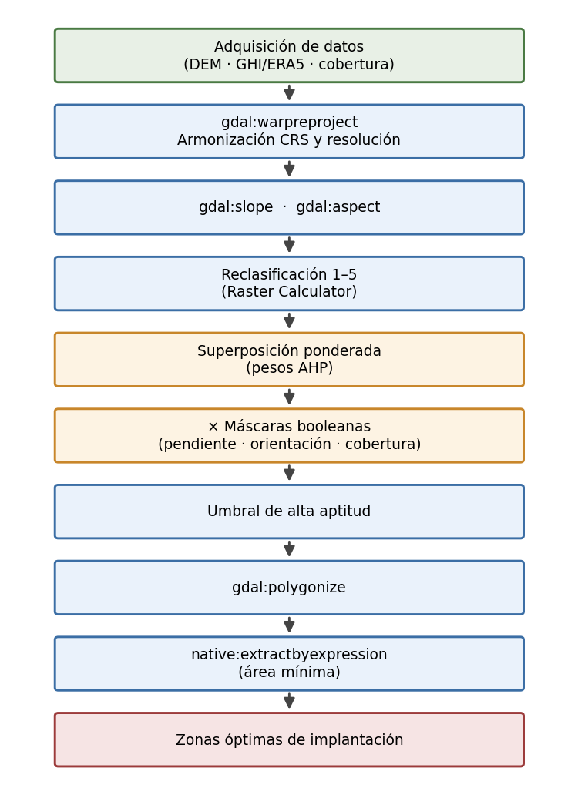
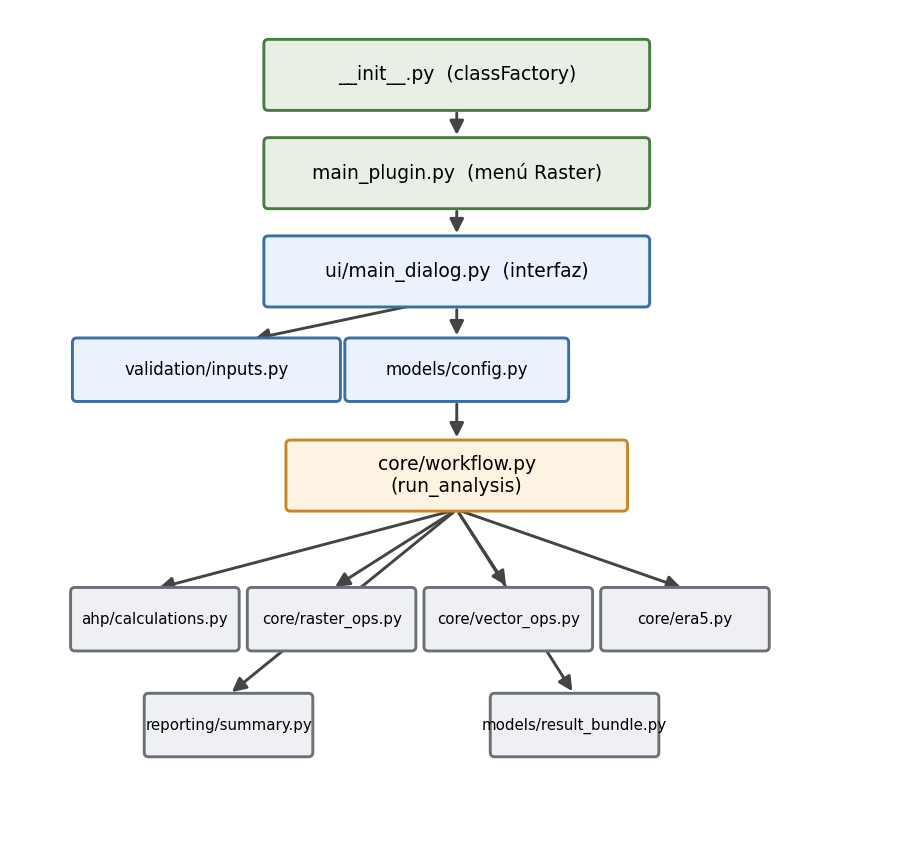
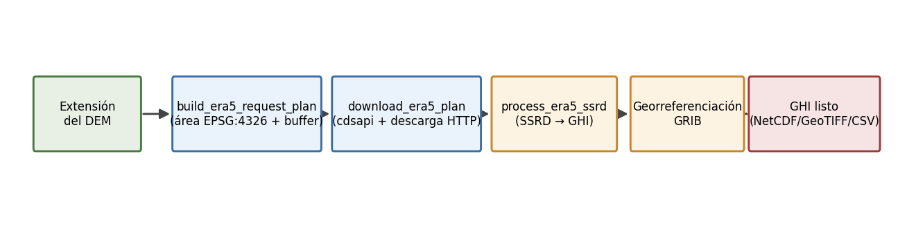

:::: {.content-visible when-format="html"}
**Docente:** Alexys Herleym Rodríguez Avellaneda, PhD — Ingeniero Civil, experto en geoinformática
::::

::: {.content-visible when-format="pdf"}
```{=latex}
% --- Ajustes de formato (preámbulo aplicado al inicio del documento) ---
\floatplacement{figure}{H}
\fvset{fontsize=\footnotesize}
\hypersetup{linkcolor=black,citecolor=black,urlcolor=blue,pdftitle={Idoneidad solar AHP - Proyecto final Geomatica General}}
\renewcommand{\contentsname}{Tabla de Contenidos}
\renewcommand{\listfigurename}{Lista de Figuras}
\renewcommand{\listtablename}{Lista de Tablas}
% --- Portada institucional ---
\begin{titlepage}
\centering
\vspace*{0.4cm}
\includegraphics[width=3.4cm]{figuras/logo_un.png}\\[0.5cm]
{\large\scshape Universidad Nacional de Colombia\par}
{\large Sede Bogotá\par}\vspace{0.35cm}
{\large\bfseries Geomática General\par}\vspace{1.3cm}
{\LARGE\bfseries Evaluación Espacial Multicriterio y Desarrollo de una Herramienta Automatizada para la Identificación de Zonas Aptas para Parques Solares Fotovoltaicos mediante AHP\par}\vspace{0.55cm}
{\large Implementación de MCDA-AHP y modelado de idoneidad en QGIS 3.x (PyQGIS): el complemento solar\_site\_suitability\par}\vspace{1.5cm}
{\large Fernán José Severich Díaz\par Pedro Joaquín Perilla Vargas\par}\vspace{1.1cm}
{\normalsize\textbf{Docente:} Alexys Herleym Rodríguez Avellaneda, PhD\par Ingeniero Civil, experto en geoinformática\par}
\vfill
{\large 8 de junio de 2026\par}
\end{titlepage}
% --- Índices ---
\tableofcontents
\listoffigures
\listoftables
\clearpage
```
:::

# Resumen {#sec-resumen}

La transición hacia matrices energéticas sostenibles exige la identificación
precisa de zonas óptimas para infraestructura fotovoltaica. Este trabajo desarrolla
un Sistema de Soporte a la Decisión Espacial (SDSS) que integra el Análisis de
Decisión Multicriterio (MCDA) mediante el Proceso de Jerarquía Analítica (AHP), la
geomorfometría derivada de un Modelo Digital de Elevación y el potencial de
radiación solar. Toda la cadena de geoprocesamiento se implementa con software libre
QGIS 3.x y la API de PyQGIS, y se distribuye en un complemento publicable,
solar_site_suitability, desarrollado bajo principios de Open Science. La herramienta
es de aplicación general: opera sobre cualquier territorio que disponga de un DEM,
una fuente de GHI (raster propio o ERA5 SSRD de Copernicus) y una capa de cobertura
del suelo, con parámetros, umbrales y orientación favorable por hemisferio
totalmente configurables. El modelo aplica restricciones absolutas (pendiente,
orientación desfavorable, cobertura no apta y área continua mínima) y reclasifica los
criterios continuos (GHI, pendiente y orientación) en una escala de aptitud ponderada
por AHP, validada con la Relación de Consistencia (CR < 0.10). La herramienta se
ejercita sobre un caso de demostración en el municipio de Concordia (Antioquia) y se
publica en el repositorio oficial de complementos de QGIS bajo licencia GPL-3.0.

# Introducción y Justificación {#sec-introduccion}

La transición hacia matrices energéticas sostenibles requiere la identificación
precisa de zonas óptimas para la infraestructura fotovoltaica. A escala de
prefactibilidad, la viabilidad espacial de un proyecto depende de la convergencia de
variables climáticas, topográficas y ambientales. El diseño de granjas solares con
estructuras de inclinación fija es altamente sensible a la geomorfometría del terreno:
las pendientes pronunciadas y las orientaciones inadecuadas generan auto-sombreado
entre las filas de paneles y alteran el ángulo de incidencia óptimo de la radiación,
reduciendo la eficiencia energética.

{#fig-contexto fig-align="center" width="95%"}

Este proyecto aborda el problema de localización espacial evolucionando desde análisis
booleanos básicos hacia un Modelo de Soporte a la Decisión Espacial (SDSS). Mediante la
integración del Análisis de Decisión Multicriterio (MCDA), el Proceso de Jerarquía
Analítica (AHP) y la automatización algorítmica, se provee una solución geomática
escalable que transforma datos geoespaciales crudos en inteligencia territorial para la
planificación energética.

La lógica de geoprocesamiento se implementa íntegramente en el ecosistema de software
libre. La cadena de trabajo se construye con QGIS 3.x, los algoritmos del marco
qgis:processing (GDAL y proveedores nativos de QGIS) y la API de PyQGIS, y se empaqueta
en un complemento reproducible y publicable.

::: {.callout-note}
## Entregable del proyecto
El resultado final es el complemento de QGIS **`solar_site_suitability`**, un modelador
de idoneidad solar multicriterio AHP de aplicación general, publicado en el repositorio
oficial de complementos de QGIS bajo licencia GPL-3.0-or-later
([github.com/pperillav/solar_site_suitability](https://github.com/pperillav/solar_site_suitability))
y actualmente en proceso de validación en plugins.qgis.org. La migración a software
libre concreta la filosofía **Open Science**: formatos abiertos, trazabilidad del
código y documentación verificable.
:::

## Justificación: el recurso solar de Colombia {#sec-justificacion}

Colombia cuenta con un recurso solar destacable. La irradiación global horizontal (GHI)
supera los 5 kWh/m²/día en buena parte del territorio, según el Global Solar Atlas
(@fig-ghi-colombia). Pese a ello, la energía solar apenas representaba el 0,1 % de la
capacidad instalada del país en 2020, frente al 68 % de la hidroeléctrica y el 31 % de la
generación térmica (@fig-matriz). Esa brecha entre potencial y aprovechamiento justifica
herramientas que faciliten la identificación de zonas aptas para nuevos parques solares.

:::: {layout-ncol=2}
{#fig-ghi-colombia}

{#fig-matriz}
::::

Un parque solar integra paneles, inversores y conexión a la red (@fig-sistema-fv); su
viabilidad, sin embargo, se decide antes de la instalación, en la selección del sitio.

{#fig-sistema-fv fig-align="center" width="50%"}

## Estado del arte y fundamento teórico {#sec-estado-arte}

El modelado del potencial solar y la selección de sitios ha evolucionado con los
avances en Geomática y teledetección.

**Cuantificación del recurso solar y reanálisis global.** Históricamente, los mapas de
radiación se basaban en la interpolación de estaciones meteorológicas, de baja densidad
en países en desarrollo. Hoy, los productos de reanálisis global como ERA5-Land
[@munozsabater2021era5] permiten estimar la Radiación Global Horizontal (GHI) con
cobertura mundial y consistencia temporal. @haz2025mapping demuestran que es posible
modelar la GHI con alta fidelidad, validada frente a catálogos de referencia mediante
métricas estadísticas.

**Modelado de idoneidad espacial (GIS-MCDA y AHP).** La hibridación de los SIG con el
MCDA se ha posicionado como estándar [@malczewski2006gis]. @liu2024suitability aplicaron
el AHP integrando dimensiones climáticas, topográficas y de cobertura. @melana2025gis
introducen una lógica de dos niveles: la exclusión booleana de áreas no aptas y la
reclasificación continua de las zonas viables.

**Vacío tecnológico y aporte.** Muchas implementaciones quedan atadas a software
propietario o a datasets de una región concreta, lo que limita su reproducibilidad.
Este proyecto empaqueta el flujo completo en una herramienta de código abierto,
parametrizable y de aplicación general, que cualquier usuario puede instalar, auditar y
aplicar a su propio territorio.

# Objetivos {#sec-objetivos}

**Objetivo general.** Desarrollar un modelo geomático multicriterio (AHP) y una
herramienta automatizada de software libre (el complemento PyQGIS
`solar_site_suitability`) para identificar zonas con máxima idoneidad espacial para
parques solares, optimizando la información topográfica y el potencial de radiación.

**Objetivos específicos.**

1. Armonizar índices climáticos (GHI, ya sea de un raster propio o descargado de ERA5
   SSRD de Copernicus y convertido a GHI) y variables geomorfométricas (pendiente y
   orientación) derivadas de un DEM, bajo un mismo sistema de referencia y resolución
   de píxel.
2. Estructurar una matriz de decisión AHP para estandarizar las variables, validando su
   confiabilidad con la Relación de Consistencia ($CR < 0.10$).
3. Desarrollar, probar y publicar un complemento en PyQGIS que ejecute la superposición
   ponderada, aplique las máscaras de exclusión, extraiga vectorialmente los polígonos
   viables contiguos por encima de un área mínima configurable, y verificar su
   funcionamiento de principio a fin mediante un caso de demostración real.

# Área de estudio {#sec-area-estudio}

A diferencia de las herramientas atadas a una región, `solar_site_suitability` es de
**aplicación general**. No incorpora ningún dataset regional fijo: el ámbito de
aplicación es cualquier área que disponga de los tres insumos básicos (DEM, GHI y
cobertura del suelo). Esta generalidad es una decisión de diseño y un resultado del
proyecto, no una limitación.

::: {.callout-tip}
## Transferibilidad geográfica
El mismo complemento sirve para Colombia, Chile, España, India o cualquier sitio del
mundo. La corrección física clave para el uso mundial es el **selector de hemisferio**
(@sec-hemisferio): en el hemisferio norte las laderas favorables miran al sur y en el
hemisferio sur miran al norte. Los umbrales, cortes de reclasificación, clases de
cobertura excluidas y pesos AHP son definidos por el usuario.
:::

**Caso de demostración: Concordia (Antioquia).** Para verificar el flujo completo se
selecciona el municipio de Concordia, en el suroeste antioqueño, un territorio de
relieve heterogéneo que ejercita de forma exigente los filtros de pendiente,
orientación y contigüidad espacial, e incluye un casco urbano que debe excluirse del
análisis. El procesamiento se ejecuta sobre el sistema de referencia oficial de
Colombia, EPSG:9377 (MAGNA-SIRGAS / Origen Nacional), a 1.0 m de resolución, con un área
de cobertura ERA5 acotada al entorno del municipio (latitud 5.89° a 6.19°, longitud
-76.06° a -75.76°).

La @fig-area-estudio delimita geográficamente el área de estudio y su localización en el
contexto nacional.

{#fig-area-estudio fig-align="center" width="95%"}

# Fuentes de datos {#sec-fuentes-datos}

La conceptualización del modelo exige armonizar varios datasets bajo un mismo CRS
proyectado y una resolución de píxel común. La @tbl-fuentes resume los insumos
primarios, todos de acceso abierto.

| Insumo | Variable derivada | Fuente / Producto | Resolución típica | Formato |
|--------|-------------------|-------------------|-----------:|---------|
| Radiación solar | GHI (kWh/m²/día) | Raster propio, o ERA5 SSRD de Copernicus (vía cdsapi) convertido a GHI | reanálisis / remuestreado | NetCDF / GeoTIFF |
| Modelo Digital de Elevación | Pendiente y orientación | DEM de alta resolución (p. ej. ALOS PALSAR RTC) | 12.5 m o mejor | GeoTIFF |
| Cobertura y uso del suelo | Máscara de exclusión | Producto LULC nacional o global (raster o vectorial) | variable | GeoTIFF o vectorial |
| Límites y exclusiones | Recorte / exclusión | Cartografía base oficial; polígonos del usuario | Vectorial | GeoPackage |

: Fuentes de datos primarias y productos derivados {#tbl-fuentes}

El complemento admite **dos fuentes de radiación**. La primera es un raster de GHI
propio. La segunda descarga automáticamente la radiación solar superficial descendente
(SSRD) de ERA5 desde el Copernicus Climate Data Store, delimitando el área a partir de
la extensión del DEM en EPSG:4326, y la convierte a GHI. El producto ERA5 se
georreferencia reconstruyendo el geotransform desde los metadatos GRIB (corrección de
georreferenciado descrita en la @sec-era5), y en ese flujo las clases de aptitud del GHI
se definen por percentiles en lugar de cortes fijos. La cobertura del suelo puede
entregarse como raster o como capa vectorial de polígonos, que el complemento rasteriza
automáticamente a la rejilla de referencia; del mismo modo, el usuario puede aportar
polígonos de exclusión adicionales, como el casco urbano del caso de demostración.

## Variables espaciales y estructura de restricciones {#sec-variables}

Siguiendo la literatura [@melana2025gis; @liu2024suitability], los parámetros se dividen
en Factores de Exclusión (máscaras booleanas) y Criterios de Evaluación Continua
(reclasificados y ponderados por AHP).

### Factores de exclusión (máscaras booleanas) {#sec-exclusion}

La pendiente y la orientación condicionan el espaciamiento entre filas de paneles y el
auto-sombreado: con el sol bajo, una fila proyecta sombra sobre la siguiente, lo que
reduce la captación (@fig-sombreado). Por eso estos factores operan como restricciones
absolutas además de criterios de evaluación.

Se aplica álgebra de mapas multiplicativa: el valor `0` inhabilita el píxel y el `1` lo
conserva. La @tbl-restricciones detalla las restricciones absolutas con sus valores por
defecto, todos configurables por el usuario.

| Variable espacial | Umbral de restricción (por defecto) | Justificación geomática |
|-------------------|-----------------------|-------------------------|
| Pendiente | $> 15^\circ$ | Alteración del ángulo de incidencia y auto-sombreado entre filas. |
| Orientación (aspect) | Lado polar (Norte/Noroeste en el hemisferio norte) | Reducción de la captación de radiación directa. |
| Cobertura del suelo | Clases definidas por el usuario (bosque, agua, urbano, áreas protegidas) | Conservación ambiental y conflicto de uso del suelo. |
| Escala espacial | Área continua menor al mínimo configurado | Inviabilidad de albergar una implantación operativa. |

: Restricciones espaciales absolutas {#tbl-restricciones}

{#fig-sombreado fig-align="center" width="75%"}

### Criterios de evaluación continua {#sec-criterios}

Los píxeles que sobreviven a la exclusión se reclasifican en una escala de idoneidad
(1 = Pobre a 5 = Excelente). La @tbl-reclass presenta los rangos por defecto y un esquema
de pesos AHP de referencia, calculado en la @sec-ahp.

| Criterio | Peso (AHP, por defecto) | Excelente (5) | Bueno (4) | Moderado (3) | Pobre (1–2) |
|----------|-----------:|---------------|-----------|--------------|-------------|
| GHI (kWh/m²/día) | 0.286 | $> 5.5$ | $5.0\text{–}5.5$ | $4.5\text{–}5.0$ | $< 4.5$ |
| Pendiente (grados) | 0.571 | $0\text{–}5^\circ$ | $5\text{–}10^\circ$ | $10\text{–}15^\circ$ | $> 15^\circ$ |
| Orientación (aspect) | 0.143 | Ecuatorial (Sur/Sureste*) | Suroeste* | Este, Oeste | Polar (Norte*) |

: Rangos de reclasificación espacial y pesos AHP {#tbl-reclass}

::: {.callout-note appearance="simple"}
\* Las orientaciones favorables y excluidas corresponden al hemisferio norte. Con el
selector de hemisferio en "Sur", el complemento invierte automáticamente la orientación
favorable hacia el norte (@sec-hemisferio). El esquema de pesos es configurable: el caso
de demostración (@sec-resultados-concordia) emplea una ponderación equitativa de los tres
criterios. Para datos ERA5, los cortes de GHI se calculan por percentiles (25, 50, 75) en
lugar de los valores fijos de la tabla.
:::

# Metodología y procesamiento geoinformático {#sec-metodologia}

La @fig-infografia sintetiza el flujo completo del análisis multicriterio, desde los
datos de entrada hasta el mapa de idoneidad.

{#fig-infografia fig-align="center" width="60%"}

La metodología se construye como una cadena de geoprocesamiento de software libre
ejecutada desde PyQGIS sobre el marco qgis:processing. Cada operación corresponde a un
algoritmo abierto y verificable.

## Modelado matemático de consistencia (AHP) {#sec-ahp}

Para acotar la subjetividad se emplea el Proceso de Jerarquía Analítica de
@saaty1980ahp. Tras establecer la matriz de comparación por pares de tamaño
$n \times n$, se calcula el vector propio principal para extraer los pesos $W_i$. La
validez se aprueba con la Relación de Consistencia ($CR$):

$$
CR = \frac{CI}{RI}, \qquad CI = \frac{\lambda_{max} - n}{n - 1}
$$

Solo se aceptan matrices con $CR < 0.10$ [@islam2024site]. La función de idoneidad
espacial ($S$), procesada píxel a píxel, es:

$$
S = \left( \sum_{i=1}^{n} W_i \cdot C_i \right) \times \prod_{j=1}^{m} R_j
$$

```{python}
#| label: calculo-ahp
#| eval: false
#| code-summary: "Cálculo del vector de pesos y la Relación de Consistencia (AHP)"

# Matriz de Saaty. Orden de criterios: [GHI, Pendiente, Orientación].
matriz = [
    [1.0,  1/2, 2.0],   # GHI
    [2.0,  1.0, 4.0],   # Pendiente (domina en el esquema por defecto)
    [1/2,  1/4, 1.0],   # Orientación
]
RI = {3: 0.58}

def calcular_ahp(M):
    n = len(M)
    sumas = [sum(M[f][c] for f in range(n)) for c in range(n)]
    norm = [[M[f][c] / sumas[c] for c in range(n)] for f in range(n)]
    pesos = [sum(norm[f]) / n for f in range(n)]
    vector = [sum(M[f][c] * pesos[c] for c in range(n)) / pesos[f] for f in range(n)]
    lmax = sum(vector) / n
    ci = (lmax - n) / (n - 1)
    return pesos, lmax, ci, ci / RI[n]

pesos, lmax, ci, cr = calcular_ahp(matriz)
# pesos = [0.286, 0.571, 0.143]; lambda_max = 3.000; CI = 0.000; CR = 0.000 (< 0.10)
```

El esquema por defecto asigna a la pendiente el peso dominante ($W = 0.571$), seguida del
GHI ($W = 0.286$) y la orientación ($W = 0.143$), con $CR = 0.000 < 0.10$. La matriz es
configurable desde el diálogo, donde el usuario expresa las comparaciones en lenguaje
verbal y el complemento las traduce a la matriz numérica y valida la consistencia de
forma automática (@sec-interfaz).

## Arquitectura del geoprocesamiento {#sec-flujo}

La @fig-flujo presenta la arquitectura del modelo, desde la adquisición hasta la
vectorización automatizada.

{#fig-flujo fig-align="center" width="60%"}

## Modelado de idoneidad nativo en QGIS {#sec-suitability-qgis}

En el ecosistema de software libre, la reclasificación y la superposición ponderada
están disponibles de forma nativa mediante el complemento Crop Site Suitability Analysis
publicado por ICIMOD [@icimod2025suitability], que implementa un flujo de equal weighted
overlay con reclasificación y umbralización integradas [@malczewski2006gis]. Este
complemento opera como implementación de referencia conceptual: define el patrón
funcional que `solar_site_suitability` extiende al sustituir los pesos uniformes por los
pesos derivados de la matriz AHP, incorporar las máscaras booleanas de exclusión
(@tbl-restricciones) y añadir el filtro de contigüidad espacial.

# El complemento solar_site_suitability {#sec-plugin}

Esta sección documenta de forma exhaustiva qué se construyó. El complemento es un paquete
de Python para QGIS 3.28 o superior, con estructura modular, pruebas unitarias e icono
propio, registrado en el menú **Raster** mediante el `classFactory` que QGIS requiere
para cargarlo.

## Arquitectura modular {#sec-arquitectura}

El código se organiza por responsabilidades, lo que facilita las pruebas y el
mantenimiento. La @fig-arquitectura muestra los subpaquetes y su relación.

{#fig-arquitectura fig-align="center" width="85%"}

| Subpaquete | Responsabilidad |
|------------|-----------------|
| `ahp/` | Cálculo del vector de pesos, $\lambda_{max}$, $CI$ y $CR$ a partir de la matriz de Saaty. |
| `core/` | Geoprocesamiento: armonización, derivadas (pendiente, orientación), álgebra de mapas, vectorización, flujo ERA5 y orquestación del análisis. |
| `models/` | Configuración tipada (`AnalysisConfig`) y empaquetado de resultados. |
| `ui/` | Diálogo de QGIS, captura de parámetros y validación interactiva. |
| `validation/` | Verificación de insumos y dependencias antes de ejecutar. |
| `reporting/` | Generación de los reportes HTML y CSV. |
| `tests/` | Pruebas unitarias puras (AHP, configuración y reportes). |

: Subpaquetes del complemento y su responsabilidad {#tbl-arquitectura}

## Interfaz del complemento {#sec-interfaz}

El diálogo guía al usuario por las entradas, los parámetros base, las restricciones y la
matriz AHP, e incorpora un resumen del modelo y un panel de estado. La @fig-interfaz-entradas
muestra las entradas y los parámetros generales; la @fig-interfaz-topografia, los cortes
de pendiente, el selector de hemisferio y las clases de cobertura a excluir.

{#fig-interfaz-entradas fig-align="center" width="85%"}

{#fig-interfaz-topografia fig-align="center" width="85%"}

El usuario expresa las comparaciones AHP en lenguaje verbal y el complemento las traduce a
la matriz numérica, calcula los pesos y la Relación de Consistencia, y advierte cuando la
matriz es inconsistente. La @fig-interfaz-ahp ilustra este control: una matriz con
$CR = 0.19$ se marca como "consistencia inválida", impidiendo ejecutar el modelo con
ponderaciones poco fiables.

{#fig-interfaz-ahp fig-align="center" width="85%"}

## Núcleo del flujo en PyQGIS {#sec-pyqgis}

La lógica se codifica sobre el marco qgis:processing. Cada operación geomática se
resuelve con un algoritmo abierto, como resume la @tbl-algoritmos.

| Operación geomática | Algoritmo en QGIS / PyQGIS |
|---------------------|----------------------------|
| Armonización (proyección/recorte) | `gdal:warpreproject` |
| Pendiente | `gdal:slope` |
| Orientación | `gdal:aspect` |
| Reclasificación / álgebra de mapas | `qgis:rastercalculator` |
| Modelado de idoneidad | Crop Site Suitability Analysis (ICIMOD) + álgebra ponderada |
| Superposición ponderada | Álgebra ponderada con pesos AHP |
| Vectorización | `gdal:polygonize` |
| Filtro por área | `native:extractbyexpression` |

: Algoritmos abiertos del flujo en QGIS/PyQGIS {#tbl-algoritmos}

```{python}
#| label: core-pyqgis
#| eval: false
#| code-summary: "Núcleo del SDSS en PyQGIS (qgis:processing)"

import processing

def modelador_aptitud_solar(dem, ghi, lulc, pesos_ahp, crs="EPSG:9377",
                            res=1.0, out_dir="salidas"):
    """Armoniza insumos, deriva pendiente/orientación, reclasifica, pondera por AHP,
    aplica máscaras y extrae sitios viables por encima del área mínima."""
    def warp(src, dst):
        return processing.run("gdal:warpreproject", {
            "INPUT": src, "TARGET_CRS": crs, "TARGET_RESOLUTION": res,
            "RESAMPLING": 0, "OUTPUT": dst})["OUTPUT"]

    dem_a = warp(dem, f"{out_dir}/01_dem.tif")
    slope = processing.run("gdal:slope",
            {"INPUT": dem_a, "OUTPUT": f"{out_dir}/04_slope.tif"})["OUTPUT"]
    aspect = processing.run("gdal:aspect",
            {"INPUT": dem_a, "OUTPUT": f"{out_dir}/05_aspect.tif"})["OUTPUT"]
    # Reclasificación (1-5), overlay AHP y máscaras con el Raster Calculator de QGIS.
    # Las máscaras booleanas usan la forma (condición) = 0 para inhabilitar píxeles.
    # Umbral de aptitud, vectorización y filtro de área:
    viable = processing.run("native:extractbyexpression", {
        "INPUT": polys, "EXPRESSION": '"DN" = 1 AND $area >= area_minima_m2',
        "OUTPUT": f"{out_dir}/17_viable_sites.gpkg"})["OUTPUT"]
    return viable
```

## Integración de ERA5 y corrección de georreferenciado {#sec-era5}

Una contribución sustantiva de la herramienta es el flujo opcional de radiación basado en
ERA5, que elimina la dependencia de un raster de GHI externo. La @fig-era5 resume el
proceso.

{#fig-era5 fig-align="center" width="100%"}

El cliente solicita únicamente el cuadro envolvente del DEM y el periodo elegido, no datos
globales. La conversión transforma la radiación acumulada (J/m²) en irradiancia (W/m²) e
irradiación (kWh/m²). La **corrección de georreferenciado** reconstruye el geotransform
desde los metadatos GRIB (`longitudeOfFirstGridPoint`, incrementos, `jScansPositively`),
corrige el desfase de medio píxel y asigna EPSG:4326, de modo que la capa descargada quede
correctamente ubicada en el espacio.

::: {.callout-warning}
## Dependencia opcional
El flujo ERA5 requiere el paquete `cdsapi` en el Python de QGIS y un archivo de
credenciales `~/.cdsapirc` del Copernicus Climate Data Store. Está declarado como
**dependencia opcional**: el flujo con GHI manual no necesita ninguna librería externa, lo
que mantiene el complemento utilizable sin configuración adicional.
:::

## Cobertura vectorial y selector de hemisferio {#sec-hemisferio}

La cobertura del suelo puede ser un raster o una capa vectorial de polígonos. En el segundo
caso, el complemento solicita el campo de atributo con el código de clase, reproyecta la
capa si es necesario y la rasteriza a la rejilla del DEM antes de aplicar la máscara de
exclusión. Este mismo mecanismo permite incorporar polígonos de exclusión específicos,
como el casco urbano del caso de demostración.

El **selector de hemisferio** es la pieza que hace al modelo físicamente correcto en
cualquier latitud. Internamente, la orientación favorable se controla mediante una tabla
de puntajes por dirección; al elegir "Sur", el complemento rota la evaluación del aspecto
180°, de modo que las laderas favorables miran al norte y las excluidas pasan a ser las de
cara al sur.

La @fig-hemisferio resume la base física de esta decisión.

{#fig-hemisferio fig-align="center" width="92%"}

## Parámetros configurables y salidas {#sec-parametros}

Los parámetros operativos clave son configurables desde el diálogo (@tbl-parametros). La
ejecución produce un conjunto de capas intermedias y finales más los reportes
(@tbl-salidas).

| Parámetro | Valor por defecto | Configurable |
|-----------|-------------------|--------------|
| Resolución objetivo | 12.5 m | sí |
| Exclusión por pendiente | $> 15^\circ$ | sí |
| Umbral de aptitud | $\geq 4$ (de 5) | sí |
| Área continua mínima | 10 ha | sí |
| Cortes de GHI (kWh/m²/día) | 4.5, 5.0, 5.5 | sí |
| Cortes de pendiente (°) | 5, 10, 15 | sí |
| Clases de cobertura excluidas | lista del usuario | sí |
| Orientación favorable | selector de hemisferio | sí |
| Fuente de radiación | GHI manual o ERA5 SSRD | sí |

: Parámetros configurables del complemento {#tbl-parametros}

| Salida | Descripción |
|--------|-------------|
| Raster de aptitud | Idoneidad ponderada AHP con máscaras aplicadas. |
| `viable_sites.gpkg` | Capa vectorial de polígonos viables que superan el umbral y el área mínima. |
| Polígonos óptimos | Selección final de polígonos contiguos de implantación. |
| Capas intermedias | Pendiente, orientación, reclasificaciones y máscaras. |
| Productos ERA5 | Solicitud JSON, NetCDF, GeoTIFF y serie CSV (cuando se usa ERA5). |
| Reporte HTML / CSV | Resumen del modelo, pesos AHP, $CR$, número de polígonos y área total. |

: Principales archivos de salida {#tbl-salidas}

## Reproducibilidad, pruebas y publicación {#sec-publicacion}

La reproducibilidad del complemento se abordó desde tres niveles: reproducibilidad del
código, reproducibilidad del flujo de geoprocesamiento y reproducibilidad de las salidas.
En primer lugar, el código se estructuró modularmente, separando la interfaz gráfica, la
validación de entradas, el cálculo AHP, las operaciones ráster, las operaciones
vectoriales, la integración con ERA5 y la generación de reportes. Esta organización
facilita la revisión técnica del complemento, permite aislar errores y favorece la
incorporación de nuevas funcionalidades sin alterar la lógica central del modelo.

En segundo lugar, el flujo de geoprocesamiento se implementó mediante algoritmos abiertos
de QGIS, GDAL y proveedores nativos de `qgis:processing`. Esta decisión evita la
dependencia de software propietario y permite que otros usuarios puedan reproducir,
auditar o adaptar el procesamiento a partir de herramientas ampliamente disponibles
dentro del ecosistema QGIS. Las operaciones de reproyección, remuestreo, cálculo de
pendiente, orientación, álgebra de mapas, rasterización, vectorización y filtrado
espacial quedan integradas en una cadena automatizada, lo que reduce la intervención
manual y disminuye la posibilidad de errores operativos.

En tercer lugar, el complemento genera salidas que permiten documentar cada ejecución.
Además de los rásteres intermedios y la capa vectorial de polígonos viables, se generan
reportes en formato HTML y CSV, junto con archivos auxiliares que registran los
parámetros utilizados. Cuando se emplea ERA5, el archivo `00_era5_request.json`
conserva la solicitud climática preparada, incluyendo la extensión geográfica, el
periodo y los parámetros temporales seleccionados. Esto permite que el análisis pueda ser
revisado posteriormente y que otro usuario pueda comprender bajo qué condiciones fue
producido el resultado.

Las pruebas realizadas incluyeron la instalación del complemento en un entorno QGIS, la
carga de capas DEM y de cobertura del suelo, la selección de parámetros de aptitud, la
validación de consistencia de la matriz AHP y la ejecución completa del flujo con datos
ERA5. Durante estas pruebas se verificó que el complemento podía conectarse a Copernicus,
descargar archivos de radiación, procesarlos, generar las capas ráster derivadas,
vectorizar los resultados y reportar el número de polígonos aptos identificados. Esta
validación operativa permitió comprobar no solo el funcionamiento interno del código,
sino también la usabilidad del flujo desde la perspectiva de un usuario final.

Desde el punto de vista de instalación, se identificó que el flujo con GHI manual
mantiene un grado alto de independencia, mientras que el flujo ERA5 requiere pasos
adicionales. Por tanto, la documentación del complemento debe distinguir claramente entre
dependencias obligatorias y dependencias opcionales. QGIS 3.28 o superior constituye el
requisito principal para ejecutar el complemento. En cambio, `cdsapi`, la cuenta
Copernicus, las licencias aceptadas y el archivo `.cdsapirc` son requisitos específicos
para la descarga directa de ERA5. Esta diferenciación evita que el usuario interprete la
dependencia ERA5 como una condición necesaria para todos los modos de uso del complemento.

Para efectos de publicación, el complemento fue preparado bajo criterios compatibles con
el repositorio oficial de complementos de QGIS: estructura de paquete, archivo de
metadatos, licencia abierta, icono, punto de carga mediante `classFactory`,
documentación funcional y separación de datos de demostración respecto de la carpeta
instalable. Esta última condición es especialmente importante, ya que los datos de
prueba, manuales extensos o archivos pesados no deben incorporarse dentro del paquete
instalable, sino mantenerse en repositorios o carpetas externas de documentación.

La publicación en el repositorio de QGIS representa un paso relevante en términos de
ciencia abierta. Permite que la herramienta sea visible para otros usuarios, facilita su
instalación desde el administrador de complementos y abre la posibilidad de revisión por
parte de la comunidad. Sin embargo, mientras el complemento se encuentre en proceso de
validación por el comité de QGIS, se debe indicar expresamente que está cargado o
sometido a revisión, evitando afirmar que ya se encuentra públicamente disponible si aún
no ha sido aprobado.

Como recomendación final para garantizar reproducibilidad, se sugiere mantener un
conjunto mínimo de datos de demostración por fuera del paquete instalable, documentar una
ejecución de referencia con sus parámetros, conservar ejemplos de salida y registrar la
versión del complemento en los reportes. Con ello, futuras modificaciones del código
podrán compararse contra una ejecución base y se podrá verificar que los cambios no
alteren de manera no controlada los resultados del modelo.

::: {.callout-important}
## Calidad y seguridad para el repositorio oficial
El complemento fue cargado en `plugins.qgis.org`, cuyo repositorio ejecuta un escáner
automático (Bandit, detect-secrets y flake8) que bloquea cualquier hallazgo crítico de
seguridad. El paquete se depuró hasta superar ese control sin hallazgos críticos, con
permisos de archivo normalizados y sin secretos ni rutas temporales inseguras, de modo
que el código sometido a revisión queda auditable, en coherencia con la filosofía Open
Science. La versión cargada se encuentra en proceso de validación por el comité de
complementos de QGIS.
:::

La @fig-plugin-publicado evidencia el complemento cargado en el repositorio oficial de
QGIS, con el identificador de complemento 5402. El portal indica que la versión aún no es
pública, a la espera de la validación del comité.

{#fig-plugin-publicado fig-align="center" width="85%"}

# Resultados y Discusión {#sec-resultados}

## Caso de demostración: Concordia (Antioquia) {#sec-resultados-concordia}

La herramienta se ejecutó de principio a fin sobre el municipio de Concordia con la fuente
de radiación ERA5 SSRD. La @tbl-concordia consigna la configuración completa de la ejecución.

| Grupo | Parámetro | Valor |
|-------|-----------|-------|
| General | CRS objetivo | EPSG:9377 (MAGNA-SIRGAS / Origen Nacional) |
| General | Resolución objetivo | 1.0 m |
| General | Umbral de aptitud | 2.0 |
| General | Área mínima | 0.2 ha |
| Topografía | Pendiente máxima | 15.0° |
| Máscaras | Aspectos excluidos | Norte, Noroeste |
| Máscaras | Clases LULC excluidas | 1, 2, 3, 4 |
| Máscaras | Exclusión vectorial | polígono `Urbano_Concordia` (casco urbano) |
| Reclasificación | Cortes de GHI | 4.50, 5.00, 5.50 |
| Reclasificación | Cortes de pendiente | 5.0, 10.0, 15.0 |
| Reclasificación | Orientación | SE=5, S=5, SW=4, E=3, W=3, NE=1, NW=1 |
| Pesos AHP | GHI / Pendiente / Orientación | 0.333 / 0.333 / 0.333 ($CR = 0.0$) |
| ERA5 | Dataset / variable | reanalysis-era5-single-levels / surface_solar_radiation_downwards |
| ERA5 | Periodo / horas | 2025-08-01 a 2025-08-04, rango 07:00–17:00 |
| ERA5 | Resolución temporal | diaria (daily) |
| ERA5 | Área de descarga | N 6.1940, O -76.0587, S 5.8940, E -75.7587 |

: Configuración de la ejecución de demostración en Concordia {#tbl-concordia}

En esta ejecución los tres criterios se ponderaron de forma equitativa (0.333 cada uno, con
$CR = 0.0$), lo que ilustra la flexibilidad de la matriz AHP frente al esquema por defecto
dominado por la pendiente. El umbral de aptitud se fijó en 2.0 y el área mínima en 0.2 ha,
acordes con la alta resolución (1.0 m) y la escala municipal del ejercicio.

La @fig-concordia-viable presenta los sitios viables resultantes sobre la ortoimagen del
municipio. La @fig-concordia-optimal muestra los polígonos óptimos finales. En ambos casos
el casco urbano de Concordia, aportado como el polígono de exclusión `Urbano_Concordia`,
queda descartado del análisis, lo que evidencia el funcionamiento de la exclusión
vectorial definida por el usuario.

{#fig-concordia-viable fig-align="center" width="92%"}

{#fig-concordia-optimal fig-align="center" width="92%"}

La ejecución produjo **15 polígonos finales**, con un **área total viable de 6.776 ha**, un
área máxima por polígono de 0.928 ha y un área mínima de 0.207 ha (@tbl-concordia-result).

| Indicador | Valor |
|-----------|------:|
| Polígonos finales | 15 |
| Área total viable | 6.776 ha |
| Área máxima por polígono | 0.928 ha |
| Área mínima por polígono | 0.207 ha |

: Resultados de la ejecución de demostración en Concordia {#tbl-concordia-result}

::: {.callout-note}
## Archivos generados
La ejecución genera la totalidad de los productos del flujo y los almacena en la carpeta de
salida especificada por el usuario: la solicitud ERA5 (`00_era5_request.json`), los
productos ERA5 (NetCDF, GeoTIFF y serie CSV) y el raster recortado, las capas intermedias
(DEM armonizado, pendiente, orientación, reclasificaciones y máscaras), el raster de
aptitud, las capas vectoriales de sitios viables y polígonos óptimos, y los reportes HTML y
CSV con el resumen del modelo. Estos archivos constituyen el registro reproducible completo
del análisis.
:::

## Parámetros AHP y prevalencia de criterios {#sec-resultados-ahp}

El AHP estandariza la ponderación de los criterios y valida su consistencia antes de
ejecutar el modelo. En el esquema por defecto, la prevalencia geomorfométrica (pendiente
$W = 0.571$, orientación $W = 0.143$) frente al recurso radiativo ($W = 0.286$) responde a
que el sombreado estructural minimiza los beneficios de una alta radiación teórica. El
control de consistencia (@fig-interfaz-ahp) rechaza matrices con $CR \geq 0.10$, lo que
asegura ponderaciones defendibles con independencia del esquema que el usuario elija.

# Conclusiones {#sec-conclusiones}

El proyecto permitió sustituir los análisis booleanos clásicos de aptitud espacial por un
modelo multicriterio basado en AHP, en el cual la ponderación de los criterios se realiza
de forma explícita, trazable y verificable mediante la Relación de Consistencia. Esta
condición reduce la arbitrariedad del proceso de decisión, ya que obliga a que las
comparaciones entre radiación solar, pendiente y orientación del terreno sean coherentes
antes de ejecutar el modelo. En consecuencia, la herramienta desarrollada no solo
automatiza una cadena de geoprocesamiento, sino que incorpora un mecanismo formal de
control sobre la calidad lógica de las decisiones del usuario.

El principal resultado del trabajo es el complemento `solar_site_suitability`,
desarrollado para QGIS 3.x mediante PyQGIS y `qgis:processing`. Este complemento
transforma un procedimiento SIG que normalmente se realizaría de forma manual,
repetitiva y propensa a errores en una herramienta reproducible, parametrizable y
reutilizable. Su arquitectura modular, la separación entre interfaz, validación, cálculo
AHP, procesamiento ráster/vectorial, integración ERA5 y generación de reportes facilita
el mantenimiento del código, la incorporación de mejoras futuras y la auditoría técnica
del flujo implementado.

La herramienta demostró ser transferible a diferentes territorios, dado que no depende de
un conjunto de datos regional fijo. El usuario puede trabajar con cualquier área de
estudio que disponga de un DEM, una fuente de radiación solar, ya sea un ráster GHI
propio o datos ERA5 SSRD descargados desde Copernicus, y una capa de cobertura o
restricciones. Esta generalidad se refuerza con el selector de hemisferio, que ajusta la
orientación favorable de las laderas según la posición del área de estudio respecto al
ecuador, permitiendo aplicar el modelo tanto en el hemisferio norte como en el
hemisferio sur.

La integración con ERA5 constituye uno de los aportes más relevantes del complemento, ya
que permite descargar información de radiación solar directamente desde Copernicus,
delimitar la solicitud al área de interés calculada a partir del DEM y generar un flujo
automatizado de conversión y georreferenciación de los datos climáticos. No obstante,
este componente también introduce una dependencia operativa que debe documentarse
claramente: para usar ERA5 se requiere una cuenta activa en Copernicus, aceptación de
licencias, configuración del archivo `.cdsapirc` e instalación de `cdsapi` en el entorno
Python de QGIS. Por ello, la opción de ingreso manual de GHI resulta fundamental, pues
mantiene la funcionalidad del complemento aun cuando el usuario no disponga de conexión,
credenciales o acceso directo a ERA5.

La ejecución de demostración en Concordia, Antioquia, permitió verificar el
funcionamiento completo del flujo: selección del DEM, cálculo del área de descarga ERA5,
procesamiento de radiación solar, derivación de pendiente y orientación, aplicación de
máscaras de exclusión, ponderación AHP, umbralización de aptitud, vectorización y
filtrado por área mínima. El resultado final fue la identificación de 15 polígonos
óptimos, con un área total viable de 6,776 ha, excluyendo el casco urbano y generando
además los archivos intermedios, capas resultado y reportes que permiten reproducir el
análisis. Este resultado confirma que el complemento opera de principio a fin y que
produce salidas útiles para ejercicios de prefactibilidad espacial.

El modelo debe interpretarse como una herramienta de soporte a la decisión y no como un
sustituto de los estudios técnicos definitivos. Los polígonos identificados representan
áreas espacialmente favorables según los criterios configurados, pero la selección final
de un sitio para un parque solar debe complementarse con análisis de propiedad predial,
acceso vial, conexión eléctrica, restricciones ambientales, amenaza geotécnica, riesgo de
inundación, condiciones constructivas, servidumbres, costos de implementación y
verificación en campo. En este sentido, el complemento entrega una primera aproximación
técnica que permite reducir el universo de búsqueda y orientar estudios posteriores de
mayor detalle.

Las pruebas realizadas también evidenciaron que la calidad de los resultados depende de
la resolución y calidad de los insumos. DEM de baja resolución o áreas de análisis
demasiado extensas pueden generar resultados fragmentados o polígonos excesivamente
dispersos, mientras que DEM de mayor resolución permiten obtener límites más definidos y
útiles para la interpretación espacial. De igual forma, la resolución espacial de ERA5
puede ser más gruesa que la del DEM, por lo que en áreas pequeñas la variabilidad de
radiación puede ser limitada y el resultado dependerá en mayor medida de la pendiente, la
orientación y las restricciones aplicadas.

Finalmente, el complemento materializa un aporte práctico al enfoque de ciencia abierta
aplicado a la planificación energética. Su desarrollo bajo software libre, su licencia
abierta, su estructura reproducible, la generación de reportes y su preparación para
publicación en el repositorio oficial de complementos de QGIS permiten que otros usuarios
puedan instalarlo, auditarlo, modificarlo y aplicarlo a nuevos contextos.

# Limitaciones y trabajo futuro {#sec-limitaciones}

Aunque el complemento desarrollado constituye una herramienta funcional para la
identificación preliminar de zonas aptas para parques solares fotovoltaicos, sus
resultados deben interpretarse dentro del alcance propio de un análisis de
prefactibilidad espacial. El modelo permite reducir el universo de búsqueda y priorizar
áreas con mejores condiciones topográficas, solares y de cobertura del suelo; sin
embargo, no reemplaza los estudios técnicos, jurídicos, ambientales, prediales,
eléctricos y constructivos requeridos para la selección definitiva de un sitio de
implantación.

Una primera limitación corresponde a la calidad y resolución de los datos de entrada. La
precisión de los polígonos viables depende directamente de la resolución del DEM, de la
calidad de la capa de cobertura del suelo y de la fuente de radiación solar empleada. En
pruebas realizadas con DEM de resolución media, como productos de 12,5 m, los resultados
tienden a presentar bordes más pixelados y una mayor fragmentación espacial. En cambio,
DEM de mayor resolución permiten obtener geometrías más definidas y útiles para análisis
locales. Por tanto, la escala del estudio debe ser coherente con la resolución de los
insumos utilizados.

Una segunda limitación está asociada a la resolución espacial de ERA5. Aunque ERA5 ofrece
una fuente climática global, consistente y reproducible, su resolución puede ser
considerablemente más gruesa que la del DEM o que las unidades prediales que se desean
analizar. En áreas de estudio pequeñas, la radiación solar puede presentar poca
variabilidad espacial, por lo que el resultado final puede quedar dominado por la
pendiente, la orientación y las restricciones de cobertura. En estos casos, ERA5 es útil
como insumo climático general, pero para diseños detallados podría ser conveniente
contrastar los resultados con fuentes de radiación de mayor resolución o con datos
locales medidos.

Una tercera limitación se relaciona con la dependencia operativa del flujo ERA5. Para
utilizar esta funcionalidad se requiere conexión a internet, cuenta activa en Copernicus,
licencias aceptadas, archivo `.cdsapirc` correctamente configurado e instalación de
`cdsapi` en el entorno Python de QGIS. Aunque estos requisitos son manejables, pueden
representar una barrera para usuarios no especializados. Por esta razón, el complemento
conserva la opción de ingresar manualmente un raster GHI externo, lo cual garantiza que
el modelo pueda ejecutarse incluso cuando no se disponga de acceso directo a ERA5.

Otra limitación importante es la simplificación de los criterios de análisis. El modelo
actual considera radiación solar, pendiente, orientación, cobertura del suelo,
restricciones espaciales y área mínima continua. Estos criterios son adecuados para una
primera aproximación geomática, pero no incorporan todavía variables clave para la toma
de decisión final, como distancia a redes eléctricas, distancia a vías, disponibilidad
predial, costo de adquisición del suelo, cercanía a centros de consumo, restricciones
normativas, servidumbres, amenaza por inundación, amenaza por movimientos en masa,
estabilidad geotécnica, restricciones arqueológicas o condiciones de seguridad.

El método AHP también introduce una limitación inherente: los pesos dependen del juicio
del usuario. Aunque la Relación de Consistencia permite verificar que las comparaciones
pareadas sean lógicamente coherentes, no garantiza que los pesos seleccionados sean los
únicos posibles ni los más adecuados para todos los contextos. Diferentes usuarios,
instituciones o proyectos pueden asignar prioridades distintas a la radiación, la
pendiente o la orientación. Por ello, los resultados deben analizarse como escenarios de
decisión y no como una verdad espacial única.

Adicionalmente, el modelo no realiza todavía una validación energética detallada. La
aptitud espacial obtenida no equivale a una estimación definitiva de producción
fotovoltaica. Para avanzar hacia una etapa de diseño, los polígonos seleccionados
deberían evaluarse con herramientas especializadas de simulación energética,
considerando inclinación real de paneles, separación entre filas, pérdidas por sombreado,
temperatura, eficiencia de módulos, inversores, disponibilidad de red, curvas de demanda
y condiciones de operación.

Como trabajo futuro, se recomienda incorporar un módulo de análisis de sensibilidad de
pesos AHP. Este módulo permitiría ejecutar varios escenarios modificando la importancia
relativa de los criterios y comparar la estabilidad espacial de los polígonos
seleccionados. De esta forma, se podría identificar si una zona permanece como apta bajo
múltiples configuraciones o si su selección depende fuertemente de una ponderación
particular.

También se recomienda integrar nuevos criterios espaciales, especialmente distancia a
redes eléctricas, distancia a vías, cercanía a centros poblados, restricciones
ambientales oficiales, amenazas naturales y disponibilidad predial. La inclusión de estos
factores permitiría pasar de un modelo principalmente físico-topográfico a un modelo de
prefactibilidad más integral, orientado a la toma de decisiones reales en planificación
energética.

Otra línea de mejora consiste en fortalecer la gestión de datos de radiación solar. El
complemento podría permitir la comparación entre diferentes fuentes de GHI, como ERA5,
Global Solar Atlas, productos satelitales de mayor resolución o mediciones locales. Esta
comparación ayudaría a evaluar la incertidumbre climática y a seleccionar la fuente más
adecuada según la escala del proyecto.

Desde el punto de vista computacional, se recomienda optimizar el manejo de áreas
extensas y periodos largos de ERA5. Para ello podrían implementarse mecanismos de caché,
reutilización de descargas previas, control de archivos temporales, ejecución por lotes y
mensajes de progreso más detallados. Estas mejoras facilitarían el uso del complemento en
estudios regionales o multianuales.

En términos de usabilidad, se recomienda fortalecer la documentación para usuarios no
expertos. Esto incluye una guía paso a paso para configurar Copernicus, instalar
`cdsapi`, crear el archivo `.cdsapirc`, seleccionar adecuadamente los parámetros del
modelo, interpretar el Consistency Ratio del AHP y comprender el significado de las capas
de salida. También sería útil incluir un conjunto de datos de demostración liviano,
alojado por fuera del paquete instalable, que permita replicar una ejecución básica del
complemento.

Finalmente, se recomienda validar el complemento en distintos contextos geográficos y
climáticos. La aplicación en regiones de montaña, zonas planas, áreas rurales aisladas,
territorios insulares y países de ambos hemisferios permitiría evaluar la robustez del
selector de hemisferio, la sensibilidad de los umbrales topográficos y la capacidad del
modelo para adaptarse a condiciones territoriales diversas. Esta validación ampliaría el
alcance científico y práctico de la herramienta, consolidándola como un instrumento
abierto de apoyo a la planificación solar fotovoltaica.



# Referencias {#sec-referencias .unnumbered}

::: {#refs}
:::
